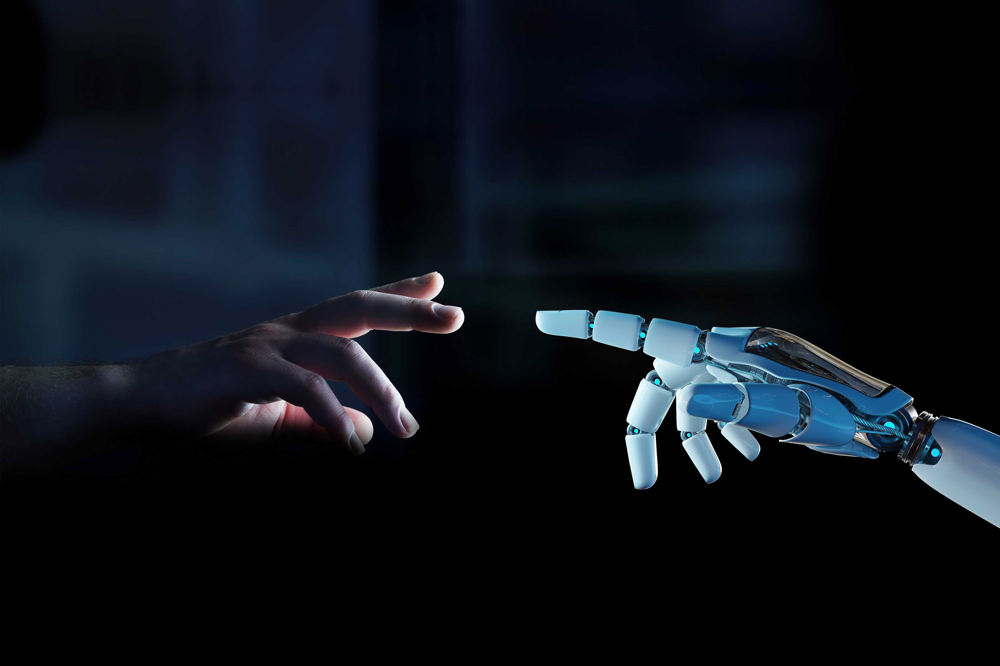
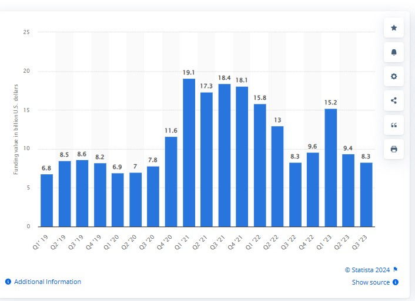

# How does AI serve as a existenial risk to our existence?
17th Nov 2023

keywords: Artificial Intelligence, AI, Existential Risks, Digital Identities, 80,000 Hours, Benefits, investment, humanity,human intelligence

## What is an existential risk?
 [Britannica](https://www.britannica.com/dictionary/eb/qa/the-meaning-of-existential#:~:text=The%20first%20phrase%2C%20existential%20threat%2C%20is%20used%20in,a%20threat%20to%20a%20people%E2%80%99s%20existence%20or%20survival.) defines an existential risk as a risk that poses a serious threat to the existence of humans or their survival. Examples of existential risks can be seen through nuclear war, climate change, global pandemics, political corruption, artificial intelligence (AI), and more. It is important that existential risks are taken seriously and that risk assessments are put into practice since existential risks can potentially cause the extinction of humans. Other than this, existential risks can impact the intelligence of humans; in particular, this is associated with AI, which will be the main focus of this writing.

## What is Artifical Intelligence(AI)
[Britannica](https://www.britannica.com/technology/artificial-intelligence) defines AI as technological systems that are able to complete tasks that require human intelligence. Artificial intelligence emerged in the 1950s and is closely associated with computer scientists Alan Turing and John McCarthy. They have been announced as the 'Fathers of AI' due to their bringing of the first foundation of AI through 'thinking machines'. Organisations that are associated with AI include OpenAI,Apple,Google,Nvidia, and more. AI can perform things such as figure out complex questions and answers; for example, this can be seen through [ChatGPT](https://openai.com/chatgpt). AI also has the ability to make creative images; this  can be seen through [DALL.E2](https://openai.com/dall-e-2). The usage of AI amongst individuals, mainly within companies or organisations has increased over the years, showing an increasingly high demand for AI. For example, this graph shows the [Statistics of the leading owners of AI, by number of patent families 2013-2022](https://www.statista.com/statistics/1032627/worldwide-machine-learning-and-ai-patent-owners-trend/) .We see that the companies listed below have all seen an increase in AI usage amongst patent families, in particular Baidu, which went from 147 famillies in 2013 to 13,993 famillies in 2022. Baidu is one of the largest consumers of AI globally. 

For AI to continue growing in skill and ability it requires, investments. In 2011, [USA funding for AI](  https://www.statista.com/statistics/672712/ai-funding-united-states/) went from under $300 million to $16.5 billion in 2019 to grow AI. The high increase in AI investment correlates with the high usage of AI. If money is being invested to improve AI, as it gradually improves, AI attracts more attention from individuals and organisations for its skills and abilities, which leads to more usage of AI and more investments. When speaking generally about AI, it is mainly associated with its advantages and its potential  to grow. In a tweet, Elon Musk responds to an article from [2017](https://twitter.com/elonmusk/status/871886151014940672?ref_src=twsrc%5Etfw%7Ctwcamp%5Etweetembed%7Ctwterm%5E871886151014940672%7Ctwgr%5Eef1b07269ad29a0422fe31a267aa310cfc89b452%7Ctwcon%5Es1_&ref_url=https%3A%2F%2Fwww.inc.com%2Fkevin-j-ryan%2Felon-musk-and-350-experts-revealed-when-ai-will-overtake-humans.html) that states that 'AI will beat us in everything by 2060', Elon Musk states, 'Probably closer to 2030 to 2040 imo. 2060 would be a linear extrapolation, but progress is exponential'. Due to the rapid growth and transformation of AI within the years it is predicted that AI will most likely surpass human intelligence, but this raises several concerns; If AI surpass human intelligence how will humans be able to control AI? Do AI have goals to empower humans? Will they harm the future of society? As mentioned earlier, AI is mainly associated with its advantages and its potential, however there is less assocation  with the disadvantages and concerns. For this reason, AI serves as a existential risk to our existence.

## How is AI an existential risk?

 

AI proposes multiple risks to the existence of humanity.Starting off, with the funding for AI. The funding for AI is very costly, causing billions to be spent annually to fund AI improvement. For example, the graph below shows [Funding for AI startup companies worldwide from 2020-2023](https://www.statista.com/statistics/1344128/worldwide-artificial-intelligence-startup-company-funding-by-quarter/). It can be seen that funding is increasing and costing more money; in particular in 2021, a estmimated amount of $72.1 billion was spent on AI. Annually, the expenditure on AI is costing more money since 2019.

 

This poses a risk since funds could have been used in other ways to support humanity, for example, through the publishing of houses, funding for health care, food, and other resources to live, etc. Another way AI funding  poses as a risk is due to the fact that funding isn't being spent on any protocols to prevent AI from being dangerous, but instead to make AI stronger. There is a lack of data in terms of finding how much is being invested into any protocols to stop AI from being dangerous; this in itself shows the lack of interest or seriousness in making AI safe for humanity. Investments to make AI safe are unheard of. 

Another reason why AI poses a risk is due to the lack of coverage and research that is being done to make AI safe for humans. AI is overlooked for all the good things it can do and acheive in the future, making people fail to acknowledge the dangers behind it. The article [80,000 Hours](https://80000hours.org/problem-profiles/artificial-intelligence/#neglectedness) suggests that an average of 400 people worldwide are aware of the dangers of AI and are working on ways to make AI safe. This is very low considering the world's population. It appears as if the dangers of AI have been neglected.

Moreover, AI poses as a risk as it is able to perform elements of identify theft or fraud. AI has advanced in a way in which it can now impersonate people by their voices, looks etc. Recently, this has been exploited by criminals to clone voices and to create fake profiles in order to perform crimes, predominately identity related. For example [The 89 year old lady who was scammed of $14,000 through fake AI-call impersonating her grandson](https://www.insideedition.com/media/videos/california-grandma-scammed-out-of-14000-by-caller-who-impersonated-grandson-81908) 

Due to how advanced the technology of AI is, the grandma was not able to tell the difference between her grandson's voice and the AI voice impersonating her grandson. Although, there are now articles spreading awareness of how to avoid being scammed by AI impersonators, they stress on the importance of how there isn't a complete solution to avoid them; [How to protect yourself from voice scams](https://www.msn.com/en-my/news/other/how-to-protect-yourself-from-ai-voice-scams-6-tips-to-follow-to-stay-safe/ar-AA1mBjlI) 

## Conclusion

<iframe width="560" height="315" src="https://www.youtube.com/embed/lfPJ7Tz4JGs" title="YouTube video player" frameborder="0" allow="accelerometer; autoplay; clipboard-write; encrypted-media; gyroscope; picture-in-picture" allowfullscreen></iframe>

## References 
Make sure you check out the [Markdown language](https://guides.github.com/features/mastering-markdown/) guide. 

