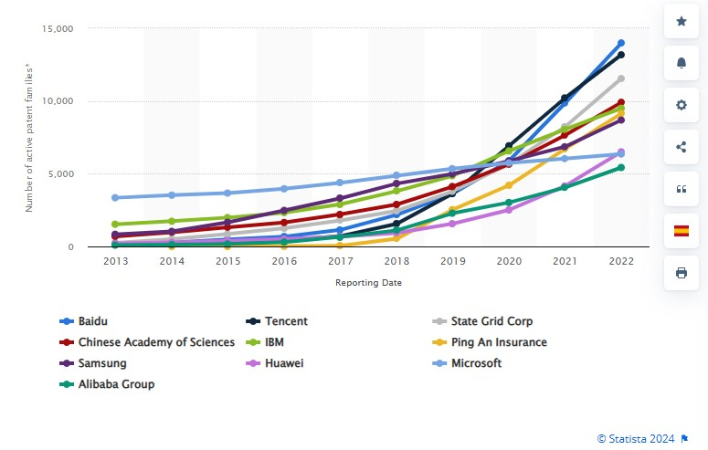

# How does AI serve as a existenial risk to our existence?
17th Nov 2023

keywords: Artificial Intelligence, AI, Existential Risks, Digital Identities, 80,000 Hours, Benefits, investment, humanity,human intelligence

## What is an existential risk?
 [Britannica](https://www.britannica.com/dictionary/eb/qa/the-meaning-of-existential#:~:text=The%20first%20phrase%2C%20existential%20threat%2C%20is%20used%20in,a%20threat%20to%20a%20people%E2%80%99s%20existence%20or%20survival.) defines an existential risk as a risk that poses a serious threat to the existence of humans or their survival. Examples of existential risks can be seen through nuclear war, climate change, global pandemics, political corruption, artificial intelligence (AI), and more. It is important that existential risks are taken seriously and that risk assessments are put into practice since existential risks can potentially cause the extinction of humans. Other than this, existential risks can impact the intelligence of humans; in particular, this is associated with AI, which will be the main focus of this writing.

## What is Artifical Intelligence(AI)
[Britannica](https://www.britannica.com/technology/artificial-intelligence) defines AI as technological systems that are able to complete tasks that require human intelligence. Artificial intelligence emerged in the 1950s and is closely associated with computer scientists Alan Turing and John McCarthy. They have been announced as the 'Fathers of AI' due to their bringing of the first foundation of AI through 'thinking machines'. Organisations that are associated with AI include OpenAI,Apple,Google,Nvidia, and more. AI can perform things such as figure out complex questions and answers; for example, this can be seen through [ChatGPT](https://openai.com/chatgpt). AI also has the ability to make creative images; this  can be seen through [DALL.E2](https://openai.com/dall-e-2). The usage of AI amongst individuals, mainly within companies or organisations has increased over the years, showing an increasingly high demand for AI. For example, this graph shows the [Statistics of the leading owners of AI, by number of patent families 2013-2022](https://www.statista.com/statistics/1032627/worldwide-machine-learning-and-ai-patent-owners-trend/) .We see that the companies listed below have all seen an increase in AI usage amongst patent families, in particular Baidu, which went from 147 famillies in 2013 to 13,993 famillies in 2022. Baidu is one of the largest consumers of AI globally. 

For AI to continue growing in skill and ability it requires, investments. In 2011, [USA funding for AI](  https://www.statista.com/statistics/672712/ai-funding-united-states/) went from under $300 million to $16.5 billion in 2019 to grow AI. The high increase in AI investment correlates with the high usage of AI. If money is being invested to improve AI, as it gradually improves, AI attracts more attention from individuals and organisations for its skills and abilities, which leads to more usage of AI and more investments. When speaking generally about AI, it is mainly associated with it's advantages and its potential  to grow. In a tweet, Elon Musk pointed out in [2017](https://twitter.com/elonmusk/status/871886151014940672?ref_src=twsrc%5Etfw%7Ctwcamp%5Etweetembed%7Ctwterm%5E871886151014940672%7Ctwgr%5Eef1b07269ad29a0422fe31a267aa310cfc89b452%7Ctwcon%5Es1_&ref_url=https%3A%2F%2Fwww.inc.com%2Fkevin-j-ryan%2Felon-musk-and-350-experts-revealed-when-ai-will-overtake-humans.html)

## Conclusion

<iframe width="560" height="315" src="https://www.youtube.com/embed/lfPJ7Tz4JGs" title="YouTube video player" frameborder="0" allow="accelerometer; autoplay; clipboard-write; encrypted-media; gyroscope; picture-in-picture" allowfullscreen></iframe>

## References 
Make sure you check out the [Markdown language](https://guides.github.com/features/mastering-markdown/) guide. 

